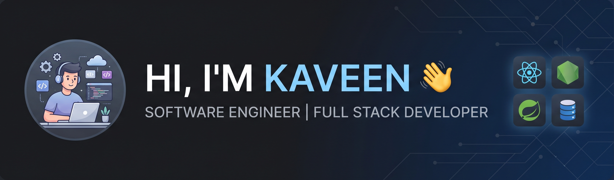

  <!-- Ensure your banner image is uploaded to your repository and matches this file path -->
  

<h1 align="center">Hi 👋, I'm Kaveen Nimsara</h1>
<h3 align="center">🚀 Software Engineer | Full Stack Developer</h3>

  
    
  

---

## 👨‍💻 About Me

- 🎓 **Education:** Recently graduated, ready to tackle real-world engineering challenges.
- 💻 **Focus:** Currently seeking entry-level roles in Software Engineering, Full Stack Development, Backend Development, or IT Systems.
- 🌱 **Currently Learning:** Diving deeper into **C#** and **Spring Boot**, alongside machine learning applications (regression modeling, text sentiment analysis, and image classification).
- 🎨 **Beyond Coding:** I have an active interest in digital content creation and developing animated programming content!
- 👨‍💻 **Portfolio:** Check out all my projects at [https://0kaveennimsara0.github.io/portfolio/](https://0kaveennimsara0.github.io/portfolio/)
- 💬 **Ask me about:** React, Python, Java, PHP
- 📫 **How to reach me:** **kaveennimsara30@gmail.com**

<h3 align="left">Connect with me:</h3>

---

## 🛠️ Languages and Tools

 
 
 
 
 
 
 
 
 
 
 
 
 
 
 
 
 
 
 
 
 
 
 
 
 
 
 
 
 
 

---

## 🚀 Featured Projects

### 🐍 Snake Species Predictor
An interactive web application incorporating role-based portals and user community feeds, designed to predict snake species via uploaded images.
- **Tech Stack:** React, Vite, Machine Learning (Image Classification)

### 🎟️ Eventora Web
A comprehensive event management platform designed to facilitate the creation, management, and booking of events with multi-role support (Admin, Organizer, Client).
- **Tech Stack:** PHP 8.3+, MySQL, HTML/CSS/JS, Composer

### 🏡 House Price Prediction Web Application
A full-stack, microservices-based web application leveraging machine learning models (Random Forest, LightGBM) to accurately estimate property prices and ranges.
- **Tech Stack:** Node.js, Express.js, Python, Flask, MongoDB, Scikit-learn

### 🚕 Cab Booking System
A web application for a complete cab booking service, featuring user reservations, secure payments, and a comprehensive administrative dashboard for fleet and user management.
- **Tech Stack:** Java, JSP, Servlets, MySQL, Maven

### 🏨 LuxeVista Resort
A mobile hotel room management and booking application.
- **Tech Stack:** Android Studio, SQLite

---

## 📈 GitHub Stats

  
    
  
    
  

